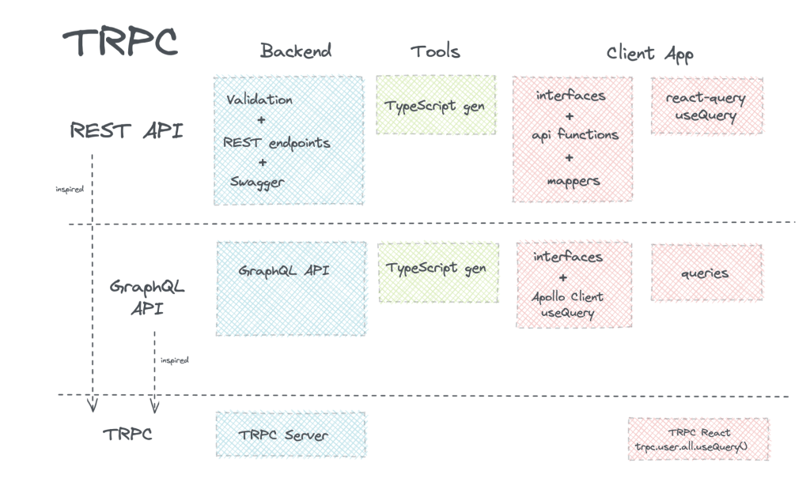

# AfternoonJS - Coding DOJO - tRPC

A quick start for tRPC.

## The evolution of API's



> Mark that it's not gRPC, but tRPC (gRPC is a protocol, tRPC is a framework)

## Server setup

### Install dependencies

```bash
# for server
yarn add @trpc/server zod
```

### Create your first router

Create a router instance

```ts
import { initTRPC } from '@trpc/server';
 
const t = initTRPC.create();
  
export const appRouter = t.router({});
```

Map to a express route

```ts
// server.ts
import * as trpcExpress from "@trpc/server/adapters/express";
import { appRouter } from "./trpc";

app.use(
  "/trpc",
  trpcExpress.createExpressMiddleware({
    router: appRouter,
  }),
);
```

Add a procedure

```ts
export const appRouter = t.router({
  getAll: t.procedure.query((req) => {
    return [
      { id: 1, name: 'John' },
      { id: 2, name: 'Jane' },
    ];
  }),
});
```


### Add UI Panel
Easy for testing & documenting your tRPC API

```bash
yarn add trpc-panel
```

```ts
import { renderTrpcPanel } from "trpc-panel";
// ...
app.use("/panel", (_, res) => {
  return res.send(
    renderTrpcPanel(appRouter, { url: `http://localhost:3000/trpc` })
  );
});
```

### Add procedure with argument

```ts
// Zod validation schema
const schema = z.object({ 
  id: z.string().describe('The user id'),
})

getById: t.procedure.input(schema).query(({ input }) => {
  return userList.find((user) => user.id === input.id);
}),
```

## Client setup

### Install dependencies

```bash
# for client
yarn add @trpc/client @trpc/react-query @tanstack/react-query
```

### Setup

Create the trpc client

```ts
// ./client/src/trpc.ts
import { createTRPCReact } from '@trpc/react-query';
import type { AppRouter } from 'your-server-module';

// Notice the <AppRouter> generic here.
const tRPC = createTRPCReact<AppRouter>({});

export default tRPC;
```

Export your router type 

```ts
// ./server/trpc.ts
// export your router type
export type AppRouter = typeof appRouter;
```

Specifies the types in your package.json

```js
// ./server/package.json
{
  "name": "@euricom/my-trpc-server",
  "types": "trpc.ts",
}
```

Import in the client

```ts
// ./client/src/trpc.ts
import type { AppRouter } from '@euricom/my-trpc-server';
```

Add the trpc & react-query client

```tsx
// App.tsx
import trpc from './trpc';
import { QueryClient, QueryClientProvider } from '@tanstack/react-query';
import { httpBatchLink } from '@trpc/client';

const queryClient = new QueryClient();
const trpcClient = trpc.createClient({
  links: [
    httpBatchLink({
      url: 'http://localhost:3000/trpc',
    }),
  ],
});

const App: React.FC = () => {
  return (
    <trpc.Provider client={trpcClient} queryClient={queryClient}>
      <QueryClientProvider client={queryClient}>
        <UserList />
      </QueryClientProvider>
    </trpc.Provider>
  );
};
```

Use the trpc client

```tsx
// UserList.tsx
const UserList = () => {
  const { data } = tRPC.getAll.useQuery();
  return (
    <div>
      <h1>UserList</h1>
      {JSON.stringify(data)}
    </div>
  );
};
```

### Add data transformation

Lets add a date 

```ts
type User {
  id: string;
  name: string;
  age: number;
  born?: Date;
}
```

```ts
const { data } = tRPC.getAll.useQuery();
type X = typeof data[0].born   // string | undefined
```

Add a transformer

```ts
// ./server/trpc.ts
import superjson from 'superjson';

const t = initTRPC.create({
  transformer: superjson,
});
```

```ts
// ./client/src/trpc.ts
import superjson from 'superjson';

const trpcClient = trpc.createClient({
  transformer: superjson,
  // ...
})
```

```ts
const { data } = tRPC.getAll.useQuery();
type X = typeof data[0].born   // Date | undefined !!!!!!
```

Add it also to the TRPC panel

```ts
app.use('/panel', (_, res) => {
  return res.send(renderTrpcPanel(appRouter, { 
    url: `http://localhost:3000/trpc`,
    transformer: 'superjson' 
  }));
});
```

### Mutation

Server

```ts
export const appRouter = t.router({
  // ...
  createUser: t.procedure
    .input(z.object({ name: z.string() }))
    .mutation(({ input }) => {
      const user: User = {
        id: `${Math.random()}`,
        name: input.name,
      };
      userList.push(user);
      return user;
    }),
```

Client

```tsx
const { data, mutate: createUser } = trpc.userCreate.useMutation();

return (
  <button onClick={() => createUser({ name: 'John' })}>Create user</button>
)
```

Invalidate the user cache

```tsx
const trpcContext = trpc.useContext();

const { data, mutate: createUser } = trpc.userCreate.useMutation({
  onSuccess: () => {
    trpcContext.getAll.invalidate();
  },
});
```

### Extra Information

- [tRPC](https://trpc.io/)
- [tRPC - Error Handling](https://trpc.io/docs/server/error-handling)
- [superjson](https://github.com/blitz-js/superjson)
- [trpc-panel](https://github.com/iway1/trpc-panel)
- [template-next-t3-mongodb](https://github.com/cosemansp/template-next-t3-mongodb)
- [trpc-openapi](https://www.npmjs.com/package/trpc-openapi)
